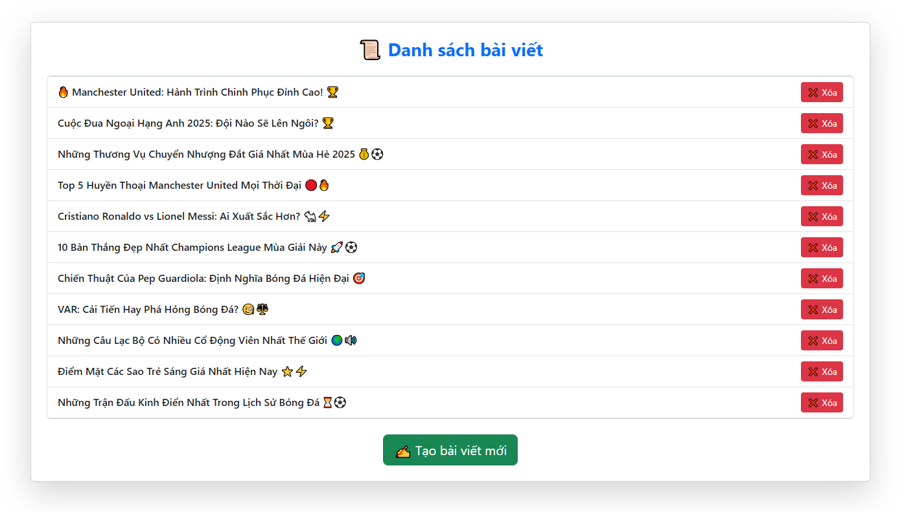
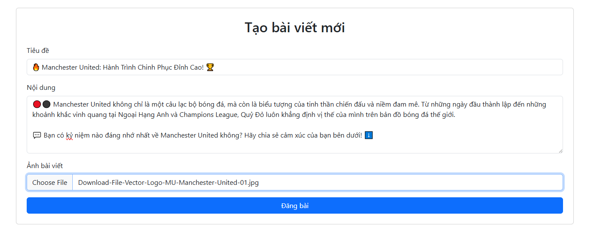
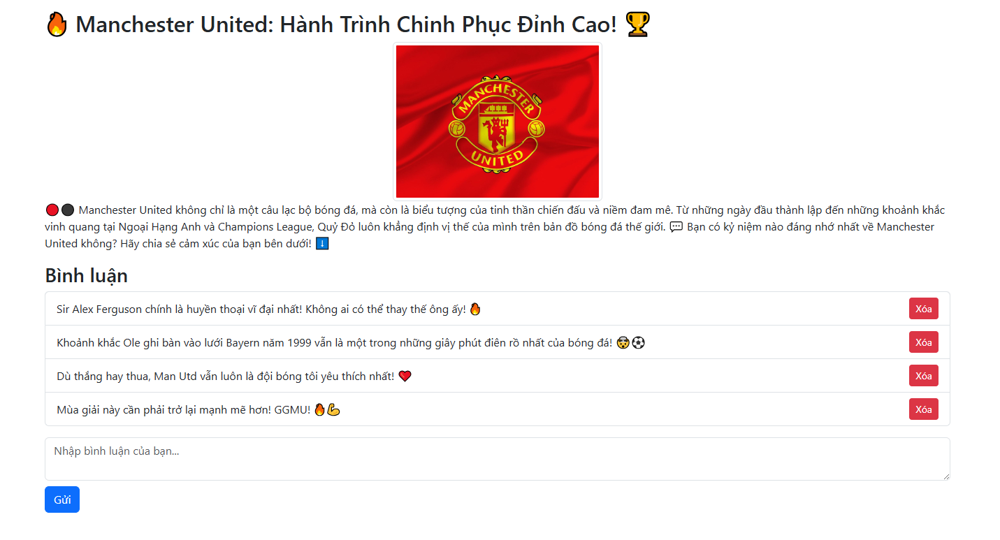
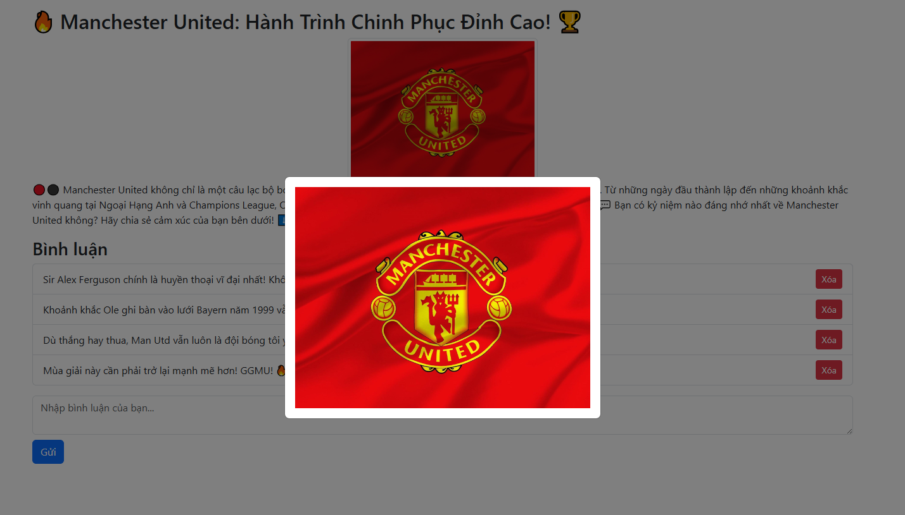

# Blog Website Application

A full-featured blog website application built with **Java Spring Boot** (backend) and **React** (frontend), supporting user authentication, post creation, commenting, and real-time chat.

## 🚀 Features  
- 📝 **Post Management** – Create and delete blog posts. *(Implemented, editing not available yet)*  
- 💬 **Comment System** – Engage with posts through comments. *(Implemented)*  
- 📂 **Image Uploads** – Upload and attach images to posts via Cloudinary. *(Implemented, file uploads not available yet)*  
- 🎨 **Modern UI** – Built with React & Bootstrap for a cleaner, responsive design. *(Implemented, further improvements ongoing)*  
- 🔜 **Planned Features**:  
  - ✅ **User Authentication** – Register & login securely with JWT authentication.  
  - 💼 **Real-time Chat** – WebSocket-based chat functionality.  
  - 📝 **Post Editing** – Allow users to edit their blog posts.  
  - 📂 **File Uploads** – Support for additional file formats beyond images.  
  - 👍 **Like System** – Allow users to like posts.  
  - 🔍 **Post Filtering** – Filter posts by date and tags.  
  - 🎨 **TailwindCSS UI** – Transition to TailwindCSS for a more customizable design.  

## 🛠 Tech Stack

### **Backend:**
- Java + Spring Boot
- PostgreSQL (Hosted on **Render**)
- WebSockets for real-time chat *(Planned)*
- JWT for authentication *(Planned)*
- Cloudinary for image storage

### **Frontend:**
- React
- Axios (API calls)
- Bootstrap (Styling)
- TailwindCSS (Work in Progress)

### **Deployment:**
- Docker (Containerization)
- Render (Hosting)

### **Cloud Services:**
- **Cloudinary** – Used for storing and managing images efficiently.

## 📸 Screenshots

### **Post List**

### **Post Creation**

### **Post Detail**

### **Zoom feature**

### **Zoom feature**

## 🐄 Handling Image Uploads & Deletion

When creating a post, uploaded images are processed as follows:
1. The image file is sent to **Cloudinary** for storage.
2. Cloudinary returns a **URL**, which is then stored in the **database**.
3. The post entry is created in the database along with the image URL.

When deleting a post:
1. The **image is deleted from Cloudinary** using its public ID.
2. The **post entry is removed from the database**.
3. This ensures **storage is optimized**, preventing unnecessary file accumulation.

## 🌍 Deployment on Render

- **Backend**: `https://blog-website-oanh.onrender.com`
- **Frontend**: `https://blog-website-frontend-shku.onrender.com`

## 💼 API Endpoints

| Method | Endpoint           | Description         |
|--------|-------------------|---------------------|
| GET    | `/api/posts`      | Get all posts      |
| GET    | `/api/post
